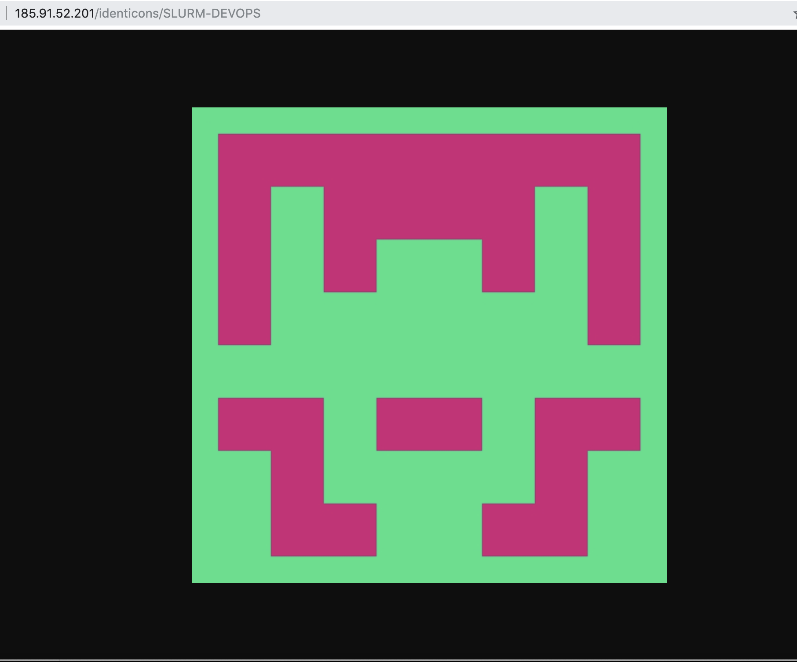
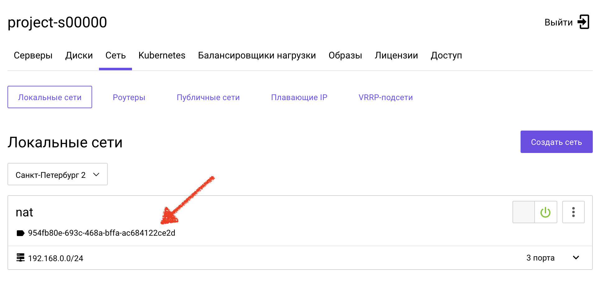

##  Packer


**Цель:** Подготовить образ через Packer. Мы будем "запекать" приложение, которое генерирует аватар на основе запроса к эндпоинту identicons/{:STRING} - email, имя пользователя и т.д., такое используется у гитхаба - там в виде аватара по-умаолчанию отображается робот, при этом сам изображения-робота является хеш-функцией




Для работы с Packer должна существовать сеть с внешним адресом и должен быть Внешний IP  



Установка Packer под Linux, ссылка для загрузки под другие дистрибутивы https://www.packer.io/downloads.html  
**Важно** нужно использовать версию **1.4.2**
```bash
wget https://releases.hashicorp.com/packer/1.4.2/packer_1.4.2_linux_amd64.zip
unzip packer_1.4.2_linux_amd64.zip
mkdir bin
mv packer ~/bin
export PATH=~/bin:$PATH
echo "PATH=$PATH" >> ~/.bashrc
```

Проверяем, что Packer установлен
```bash
$ packer -v
1.4.2
```

Перейдем в каталог с packer-файлами
```
cd packer_repo
```

Скопируем файл с переменными
```bash
cp vars.json.example vars.json
```
Откроем его на редактирование и заполним (*tenant_id* тоже самое что и Project ID)
```bash
vim vars.json
```
```json
{
  "domain_name": "DOMAIN_NAME",
  "tenant_id": "PROJECT_ID",
  "username": "USER_NAME",
  "password": "PASSWORD",
  "networks": "NETWORK_ID",
  "region": "REGIONS",
  "availability_zone": "ZONE",
  "volume_type": "fast.ZONE"
}
```

Скопируем и заполним prometheus.yaml - конфигурация нужна для автодискавери. Prometheus будет опрашивать АПИ на предмет новых ВМ
```bash
cp prometheus.yaml.example prometheus.yaml
```

```bash
vim prometheus.yaml
```

```yaml
        domain_name: DOMAIN
        region: REGION
        username: USERNAME
        password: PASSWORD
        project_id: PROJECT_ID
```

Запускаем сборку образов в один поток. Процесс займет некоторое время
```bash
packer build -parallel=false -var-file=vars.json build.json
```

<details>
  <summary>Вывод packer build -parallel=false -var-file=vars.json build.json</summary>
packer build -parallel=false -var-file=vars.json build.json

...  
Build 'www-node' finished.

==> Builds finished. The artifacts of successful builds are:  
--> bastion-host: An image was created: 6f0c5f04-8dc2-41a3-befc-ebd26c8c1c61  
--> www-node: An image was created: a3c1bc8d-1b8f-4657-94aa-e0eee1651d2e
</details>

Проверить образы можно в панели управления или через команду openstack, можно воспользоваться докер-образом, прокинув в него rc-файл (в панели управления в настройках проекта вкладка доступ)

```bash
docker run -ti --rm -v $(pwd)/rc.sh:/rc.source f3ex/openstack_client:0.3
...
source /rc.source
```

```bash
bash-5.0# openstack image list --private
+--------------------------------------+----------------------------------+--------+
| ID                                   | Name                             | Status |
+--------------------------------------+----------------------------------+--------+
| 6f0c5f04-8dc2-41a3-befc-ebd26c8c1c61 | centos-bastion-packer-1566644140 | active |
| a3c1bc8d-1b8f-4657-94aa-e0eee1651d2e | centos-node-packer-1566644141    | active |
+--------------------------------------+----------------------------------+--------+
```
