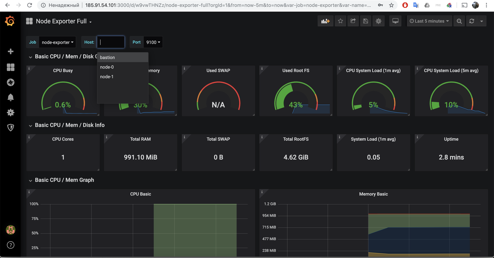

##  Terraform


**Цель**: Развернуть инфраструктуру и наше приложение через terraform с использованием Load Balancer  

Схема сети


Установка Terraform под Linux, ссылка для загрузки под другие дистрибутивы https://terraform.io/downloads.html  
```bash
wget https://releases.hashicorp.com/terraform/0.12.6/terraform_0.12.6_linux_amd64.zip
unzip https://releases.hashicorp.com/terraform/0.12.6/terraform_0.12.6_linux_amd64.zip
mkdir bin
mv terraform ~/bin
export PATH=~/bin:$PATH
echo "PATH=$PATH" >> ~/.bashrc

```

Проверяем terraform
```bash
terraform --version
Terraform v0.12.6
```

Переходим в каталог terrafor_repo
```bash
cd terraform_repo
```
Копируем файл с доступами
```bash
cp secret.tfvars.example secret.tfvars
```
Открываем его и заполняем
```bash
vim secret.tfvars
```

В **public_key** нужно вставить ваш публичный ключ
```bash
cat ~/.ssh/id_rsa.pub
```
```hcl
user_name = "USERNAME"
user_password = "PASSWORD"
domain_name = "DOMAIN"
project_name = "PROJECT_NAME"
public_key = "SSH PUBLIC KEY"
region = "РЕГИОН"
az_zone = "ЗОНА"
volume_type = "fast.ЗОНА"
```

Провижининг будет работать при включенном  ssh-agent'e, если он не используется, нужно будет в файле bastion.tf заменить **agent = true** в провижининге в трех местах на **private_key = "${file("~/.ssh/id_rsa")}"**

Инициализируем Terraform
```bash
terraform init
```

Планируем
```bash
terraform plan -var-file="secret.tfvars"
```

Применяем конфигурацию
```bash
terraform apply  -var-file="secret.tfvars"
...
Do you want to perform these actions?
  Terraform will perform the actions described above.
  Only 'yes' will be accepted to approve.

  Enter a value: yes <<<<<<<<

...
Apply complete! Resources: 24 added, 0 changed, 0 destroyed.

Outputs:

LB_floatingip_address = 185.91.54.93
bastion_floatingip_address = 185.91.54.101
prometheus_dashboard = http://185.91.54.101:9090/targets
site_address = http://185.91.54.93
```


Получим ссылку на мониторинг и откроем ее в браузере
```bash
$ terraform output prometheus_dashboard
http://185.91.54.101:9090/targets
```


Откроем страницу на веб-сервер с аватаром
```bash
$ terraform output site_address
http://185.91.54.93
```

При нажатие на F5 запросы будут идти на разные ноды и будет отдаваться разный аватар сервера

  


Теперь увеличем количество нод до трех
```bash
TF_VAR_server_count=3 terraform apply -var-file="secret.tfvars"
```

На странице мониторинга появится третья нода и в отдаче веб-сервера появится новый аватар

  


Теперь если прогнать конфигурацию с дефолтными значениями, то терраформ удалит последний хост, он так же исключиться из мониторинга и выдачи LB
```bash
terraform apply -var-file="secret.tfvars"
```

на бастион хост через провижининг установилась grafana с дашбордом, получим ссылку и перейдем по ней
```bash
$ terraform output grafana_dashboard
http://185.91.54.101:3000/ with login admin and password secret_password
```
Можно дашборд Node Exporter Full и посмотреть  графики (время отображения выставить на 5 минут)




Разберем стенд
```bash
$ terraform destroy -var-file="secret.tfvars"
....
  Enter a value: yes
...
```

