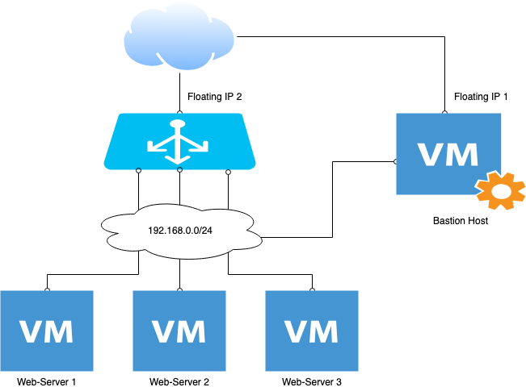

## Пример создания baked инфрастуктуры с помощью Packer и Terraform

**Цель:** создать образ с приложением через packer, описать и развернуть инфрастуктуру с приложением и LB, настроить мониторинг Prometheus на auto discovery.

Схема приложения:  

[Packer](1.%20Packer/)  
[Terraform](2.%20Terraform/)
